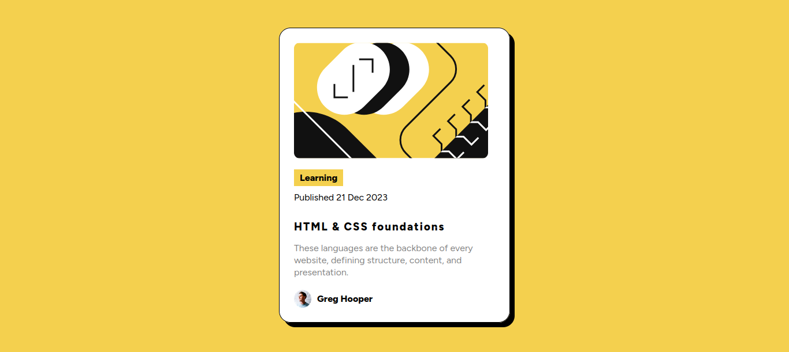

## Table of contents

- [Overview](#overview)
  - [The challenge](#the-challenge)
  - [Screenshot](#screenshot)
- [My process](#my-process)
  - [Built with](#built-with)
  - [Continued development](#continued-development)

## Overview

### The challenge

This challenge was the most easy for me because I was practice very hard so I can do this challenge very faster.

### Screenshot

## My process

I spent 1 hour in this challenge so I didn't a lot of things, I use flexbox for center the container and the perfil photo, the HTML is divided in 3 sections and the CSS is well documented.

### Built with

- Semantic HTML5 markup
- CSS custom properties
- Flexbox

### Continued development

I will continue to practice in my knowledge about flexbox and responsive design.

